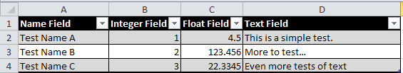

# Tbl
Tbl is a lightweight CSV (comma separated value) and tab-delimited table reader.  If you pass the Table object a properly formatted string, you can then retrieve integer, double, or string values either by index number or name.

## Building Tbl
The Tbl library is distributed as a single header file, Tbl.hpp, so you can include the library header and start using it immediately.  Tbl requires a C++ 17 compliant compiler.

## Tbl Design
Table is explicitly designed for game development or similar scenarios, where the table data is fixed by designers and only needs static verification.  Exceptions are not explicitly used, and runtime parameter errors will either assert or set an error flag.  It also allows the user to supply a custom allocator, as this is a common requirement for many games.

## What is Tbl Used For?
The Tbl library is designed to read tabular spreadsheet data that has been exported to a text format.  Two common formats are CSV (Comma Separated Values) and tab-delimited text files.  The library automatically determines the correct file format when parsing it.

These values are typically exported from a spreadsheet containing a table, which may look something like the following:



Notice how across the top row, there is a header containing labels that describe each column data.  **This header data is mandatory, as Tbl uses this to enable accessing specific columns by name instead of by index**.  

Column A (in this example, called ```Name Field```) is **assumed to be a text field that uniquely identifies the row**.  

Within the table itself, integers, floating point numbers, and text are automatically detected and parsed.

## How to Use Tbl
The Tbl library consists of a single class, called ```Table```.  Let's load up our sample exported CVS file first.

    std::ifstream f("Test1.cvs");
    std::stringstream buffer;
    buffer << f.rdbuf();
    
Now, we instantiate a table with the loaded string data, and check that it parsed correctly.

    Table t(buffer.str());
    if (!t)
       // handle error
       
The table has been parsed and organized, so now let's access some of the data.  First, there are members to tell us the number of columns and rows in the table.  

    size_t columns = t.GetNumColumns();
    size_t rows = t.GetNumRows();
    
Let's say we want to get a specific table cell by index values.  You can do so as follows.  Remember, the header doesn't count, and the indices are zero-based, so this is retrieving row 3, column D of the spreadsheet table.

    auto str = t.Get<std::string>(1, 3);
    
This will return the string "More to test..."  It's generally the case that you will know which types of data are found in a given row.  In the rare case this isn't so, you can retrieve the ```std::variant``` directly using the ```GetData()``` member function and query the variant's index value for the type, then use ```std::get``` to retrieve the value.  It might look something like this:

    auto var = t.GetData(1, 3);
    if (var.index == 2)
        auto str = std::get<std::string>(var);
        
When checking the variant index value, 0 is ```int64_t```, 1 is ```double```, and 2 is ```std::string```.

Perhaps even more useful is being able to retrieve values by name instead of by index numbers.  This not only more intuitive, but protects you from future modifications.  For instance, even if you insert a new column or row, the named values will remain valid.  Let's see how this looks with our last example.

    auto str = t.Get<std::string>("Test Name B", "Text Field")
    
Similarly, you can use ```int64_t``` or ```double``` in the same way to retrieve integer or double values from appropriate fields.

If you wish to mix index and name-based lookups, you can use the member functions ```GetRowIndex()``` or ```GetColumnIndex()``` and pass the value to the index-based ```Get()``` function.
